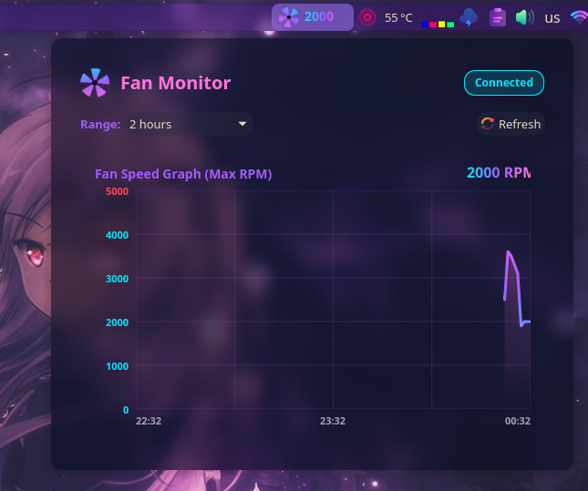

# Fan Monitor (KDE Plasma 6 Widget)




A beautiful, translucent fan and temperature monitoring widget for KDE Plasma 6. Designed to blend perfectly with neon and translucent themes (like *"Utterly Sweet"*), while offering custom aesthetic adjustments and **zero CPU/GPU overhead** animations.

## Features
- **Real-time Monitoring:** Keep track of your system temperatures and fan speeds.
- **Three Themes:**
  1. `Utterly Sweet (Solid)` — Neon cyberpunk gradients.
  2. `Clean Window (Transparent)` — Borderless, relying purely on KWin's system blur effects.
  3. `Utterly Sweet (Translucent)` — Lighter backdrop, allowing background windows and wallpapers to bleed through.
- **Optimized Animation Engine:** Animations rely on highly performant QtQuick Timers capping at 10 FPS, meaning practically zero overhead on your GPU or CPU. The animation pace dynamically scales with the RPM of your fans!
- **On/Off Toggle:** Optionally freeze animations altogether for 100% peace of mind.
- **Dynamic Graphical Chart:** Visualize heat fluctuations over the last chosen timeframe (e.g., 2, 5, or 8 hours).
- **Responsive Status Alerts:** Colors elegantly shift to orange and critical red thresholds.

## Requirements
* KDE Plasma 6 (`org.kde.plasma.core 6.0+`)
* `lm-sensors` installed on the host system to provide real sensory data.

## Installation

### From Source/Manual:
Clone the repository and install using `kpackagetool6`:
```bash
git clone https://github.com/limankotovic-byte/fan-monitor-plasmoid.git
cd fan-monitor-plasmoid
kpackagetool6 -t Plasma/Applet -i package
```

*(To upgrade an existing installation: `kpackagetool6 -t Plasma/Applet -u package`)*

After installation, "Fan Monitor" will appear in your "Add Widgets" panel in KDE Plasma.

## Setup (Sensors)
Run the `sensors-detect` command once to ensure your kernel is reading all available fan speeds and diodes correctly:
```bash
sudo sensors-detect
```

## What's New in v1.1

See [CHANGELOG.md](CHANGELOG.md) for the full list of changes.

**Highlights:**
- 🔧 Eliminated code duplication (5+ repeated loops → helper functions)
- 🐛 Fixed crash on empty sensor data
- 🐛 Fixed regex validation preventing empty keys
- ⚡ Canvas performance optimization (`Canvas.Cooperative`)
- 📐 Replaced magic numbers with named constants
- 📝 Added JSDoc comments to all functions
- 🔄 Fixed history data leak on time range change
- 📋 Consistent code formatting throughout

## Contributing

Contributions are welcome! Please feel free to submit a Pull Request.

1. Fork the repository
2. Create your feature branch (`git checkout -b feature/amazing-feature`)
3. Commit your changes (`git commit -m 'Add some amazing feature'`)
4. Push to the branch (`git push origin feature/amazing-feature`)
5. Open a Pull Request

## License
Provided under the GNU GPL v3.0 License.
